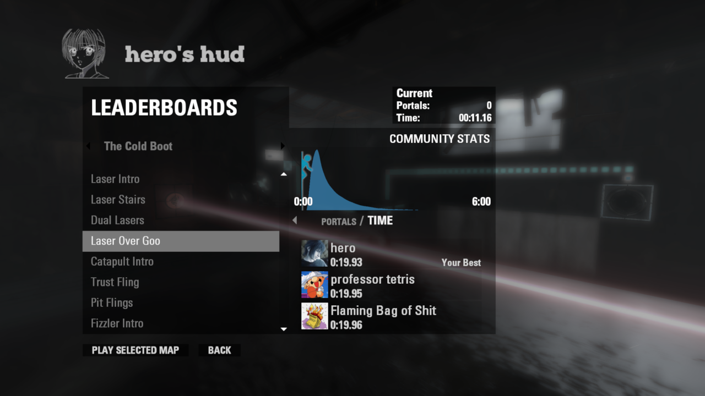

# screenshots
 
 

# extra features
| minimal net_graph       | original contimes & cm timer                                            | font(s) for sar hud     |
| ----------------------- | ----------------------------------------------------------------------- | ----------------------- |
|  |   |  |

# installation
1. download the latest [release](https://github.com/aIIison/hud/releases/)
2. rename `update` directory to `portal2_dlc3`
3. create folder `portal2_dlc4` (move all your existing vpks here)
4. extract the files in `portal2_dlc4`
